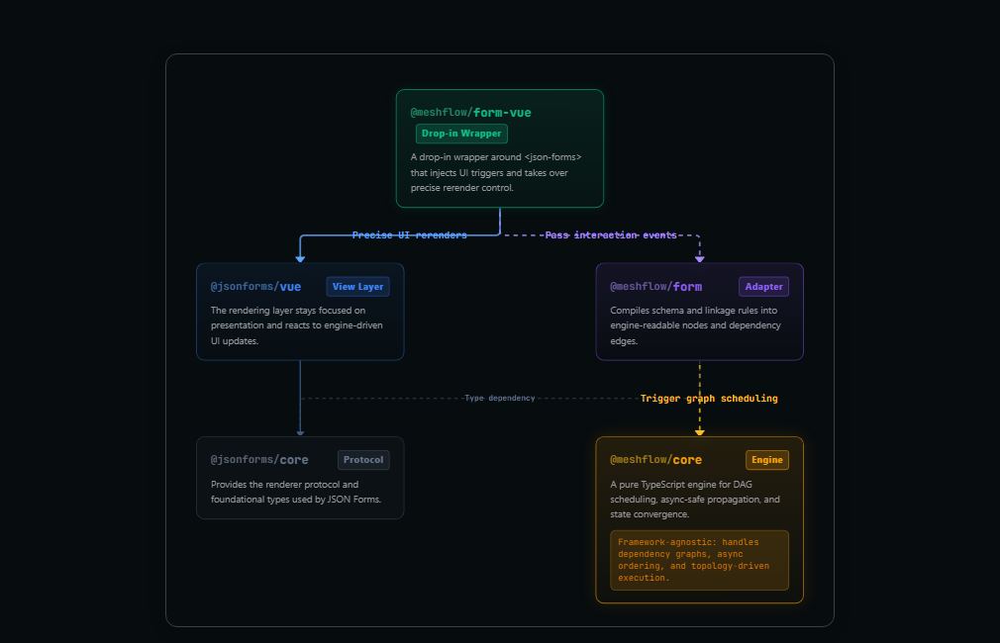

<p align="center">
  
</p>

<h1 align="center">MeshForm Vue</h1>

<p align="center"><strong>A deterministic linkage layer for <code>@jsonforms/vue</code>.</strong></p>

<p align="center">Use MeshForm Vue when your JSON Forms setup needs more than rendering: dependent fields, derived values, async propagation, and bidirectional constraints.</p>

<p align="center">It keeps the JSON Forms stack you already know and moves complex state evolution into an explicit rule engine powered by MeshFlow.</p>

## What It Can Do

- refresh downstream options when upstream fields change
- fill derived fields like price, premium, or total in a predictable order
- keep async option loading and remote lookups from corrupting newer state
- model cyclic or bidirectional constraints without turning form logic into `watch` spaghetti

## Where It Sits

The graph below is captured from the real architecture page in the docs.
It shows where MeshForm Vue sits between JSON Forms and the MeshFlow engine.

<p align="center">
  
</p>

## What It Is

MeshForm Vue is a drop-in enhancement layer for teams who already like the `JSON Schema` + `UISchema` model, but no longer want complex linkage logic to live in scattered `watch`, ad-hoc state, and timing-sensitive UI code.

## What Problem It Solves

The real difficulty in large business forms is rarely rendering.

It starts when fields begin to pull on one another:

- one selection changes the available options of another field
- one value drives visibility, readonly state, and validation of multiple fields
- async fetches race with newer user input
- totals, rates, and derived values must update in a predictable order
- bidirectional constraints need to converge instead of looping forever

JSON Forms already gives you a strong schema-driven rendering model.
MeshForm Vue focuses on the layer that usually becomes messy afterward: state evolution.

## What It Adds to JSON Forms

MeshForm Vue is not a replacement for JSON Forms.
It is a deterministic linkage layer on top of `@jsonforms/vue`.

| You keep | You add |
| --- | --- |
| `JSON Schema` | explicit dependencies with `from()` |
| `UISchema` | engine-managed propagation through `:rules` |
| custom renderers | deterministic execution order |
| Vue 3 component usage | async-safe updates and convergence |

That keeps rendering where it already belongs, while moving state orchestration into a dedicated engine.

## Install

```bash
npm install @meshflow/form-vue
```

Peer dependencies usually include `vue`, `vuetify`, `@jsonforms/core`, `@jsonforms/vue`, `@meshflow/core`, and `@meshflow/form`.

## Example

```ts
import { from } from '@meshflow/form-vue'
import type { FromDescriptor } from '@meshflow/form-vue'

const rules: Record<string, FromDescriptor> = {
  'product.name.options': from('product.category', getOptions),
  'product.unitPrice.value': from('product.name', getPrice),
  'billing.total.value': from(
    ['product.quantity', 'product.unitPrice'],
    (qty, price) => qty * price,
  ),
}
```

This is the core idea: declare dependencies once, then let the engine handle propagation, ordering, and stabilization.

## Where It Fits Best

MeshForm Vue shines when a form is no longer just data entry, but a small stateful system:

- underwriting and insurance application flows
- pricing, quoting, and allocation workflows
- procurement and order configuration
- product eligibility and solution design
- internal tools with dense cross-field derivation
- teams already using JSON Forms and feeling the weight of custom linkage code

If your form is mostly plain CRUD, plain JSON Forms may already be enough.

## Why Teams Care

- field interaction becomes readable instead of implicit
- execution order becomes predictable instead of accidental
- async behavior becomes manageable instead of fragile
- business rules become testable without going through the UI
- complex linkage stops leaking all over the component tree

## Documentation

- [Quick Start](./guide/getting-started.md)
- [Architecture](./guide/architecture.md)
- [MeshForm Component](./guide/mesh-form.md)
- [Why MeshForm Vue](./guide/why.md)

## Demo Scenarios

- [Cloud Procurement Form](./demos/order-form.md)
- [Entangle Bidirectional Linkage](./demos/entangle.md)
- [Insurance Application](./demos/insurance.md)
- [Group Insurance Pricing](./demos/group-insurance.md)
- [Pension Planning](./demos/pension.md)
- [Engineering Quote](./demos/engineering-quote.md)

## Stack

- `Vue 3`
- `@jsonforms/core`
- `@jsonforms/vue`
- `@meshflow/core`
- `@meshflow/form`
- `@meshflow/form-vue`

## License

Published MeshFlow packages are currently licensed under `AGPL-3.0-or-later`.